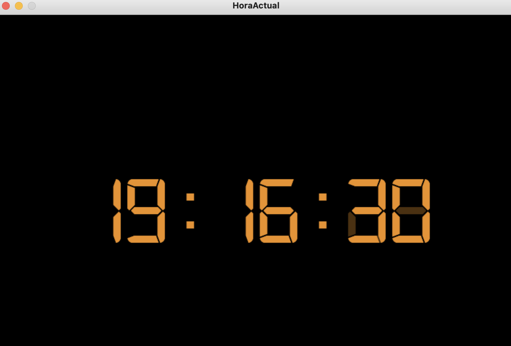
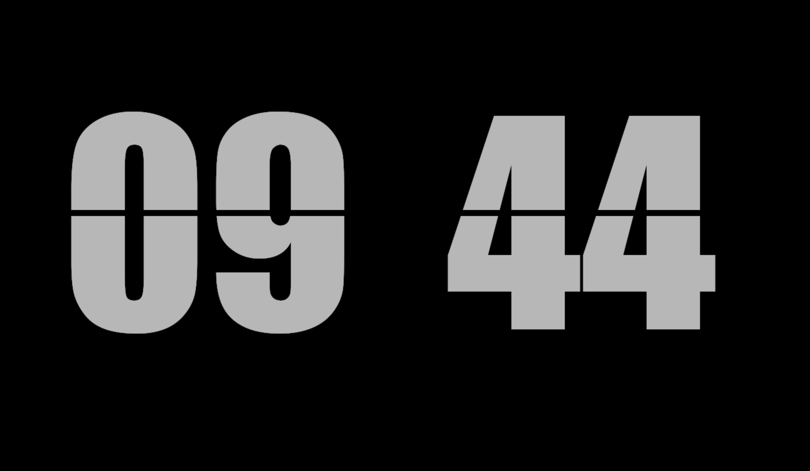
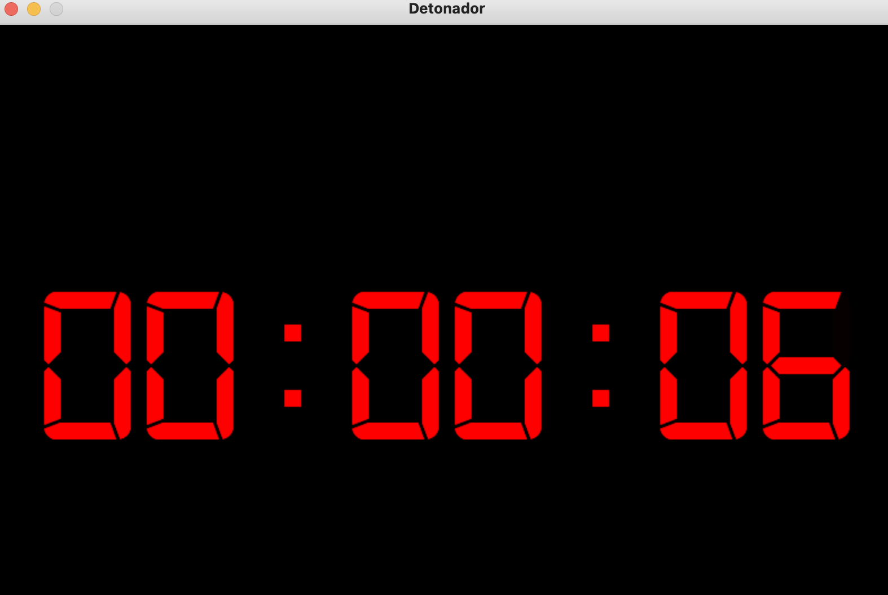
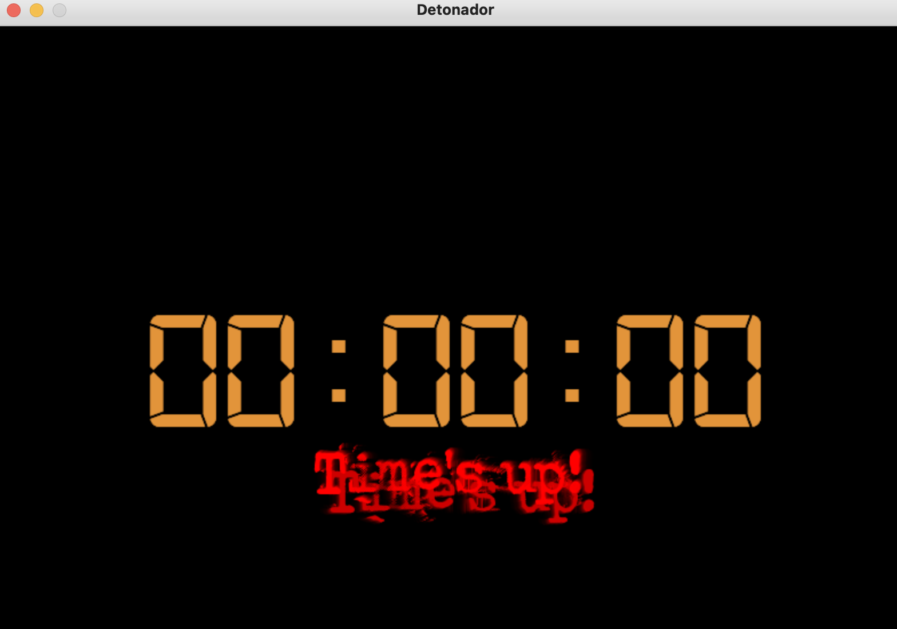

# Programa de Reloj y Temporizador

El programa es una aplicación desarrollada en Python utilizando la biblioteca Pygame, diseñada para funcionar como un reloj digital y un temporizador de cuenta regresiva. Ofrece opciones para personalizar el tamaño de la fuente, el color del texto y el título de la ventana.

### Características Principales:

1. **Reloj Digital en Pantalla:**
   - El programa muestra en tiempo real la hora actual en formato de reloj digital.
   - Utiliza una fuente personalizada para simular un reloj de 7 segmentos.
    
   - Con la opción -o se muestra un antiguo reloj flip
       

2. **Temporizador de Cuenta Regresiva:**
   - El usuario puede establecer un tiempo en horas, minutos o segundos para una cuenta regresiva.
   - La cuenta regresiva se muestra en pantalla en formato de reloj digital.
   - La cuenta regresiva disminuye cada segundo hasta llegar a cero.
    

3. **Personalización:**
   - El usuario puede personalizar el tamaño de la fuente y el color del texto del reloj y la cuenta regresiva.
   - También se puede cambiar el título de la ventana de la aplicación.

     OPCIONES DE RELOJ

      ´´clock -d
      Crea un reloj digital, opción por defecto si no se especifica otra cosa
     
      ´´clock -o
      Crea un reloj flipflop,
      
      Ejemplo:
      
      ´´clock -o -t 400 -f
      Crea reloj flip flop,  tamaño de fuente 400 y a pantalla completa
      
      ´´clock -c "#e2943a" -f -t 200 -ti HoraActual
      Crea un reloj color ambar, a pantalla completa con hora de sistema, fuente tamano 200,  y titulo de la ventana "HoraActual"
      OPCIONES DE CUENTA REGRESIVA
      
      Las siguientes opciones activan una cuenta regresiva:
      -s   Segundos a contar hacia atras
      -m   Minutos a contar hacia atras
      -h   Horas a contar hacia atras
      
      Ejemplo:
      
      clock -m 5 -s 10
      Crea una cuenta regresiva de 5 minutos y 10 segundos
      
      Ejemplo 2:
      
      clock -h 3 -c "#e2943a" -t 150  -ti Detonador
      Crea una cuenta regresiva de tres horas, color ambar, con fuente tamano 150, y titulo de la ventana "Detonador"
      
      
      DURANTE LA EJECUCION
      presionar
       f   para alternar entre pantalla completa o ventana
       q   para salir
       +   para aumentar tamaño de la fuente
       -   para disminuir tamaño de la fuente

 

4. **Efectos Visuales:**
   - Cuando la cuenta regresiva llega a cero, se muestra el mensaje "Time's up!" en rojo.
   - El mensaje también vibra rápidamente en su lugar.
   - - 

5. **Notificación de Sonido:**
   - Cuando la cuenta regresiva llega a cero, se reproduce un sonido de alarma.

6. **Interfaz de Usuario Amigable:**
   - La interfaz de usuario se ejecuta en una ventana visual.
   - El programa acepta argumentos de línea de comandos para configurar el temporizador y otras opciones.

### Uso y Aplicaciones:

Este programa es adecuado para diversas situaciones donde se requiera un reloj digital o un temporizador de cuenta regresiva. Puede ser útil en la gestión del tiempo, medición de intervalos, tareas temporizadas y recordatorios.

### Beneficios:

- Ofrece una solución visualmente atractiva y funcional para ver la hora actual y establecer temporizadores.
- Permite personalizar la apariencia y el comportamiento según las preferencias del usuario.
- Facilita la gestión del tiempo y las actividades con notificaciones visuales y sonoras.

En resumen, este programa es una herramienta versátil y personalizable para visualizar la hora actual y establecer temporizadores de cuenta regresiva, con opciones de personalización y efectos visuales que lo hacen práctico y entretenido de usar.
